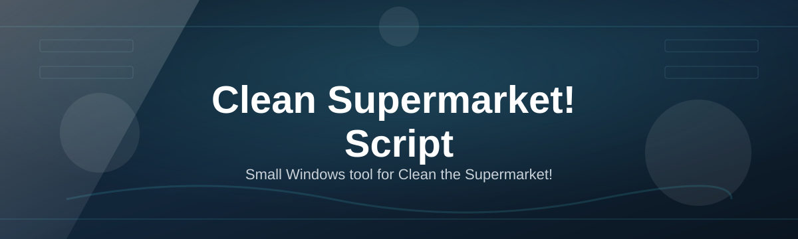
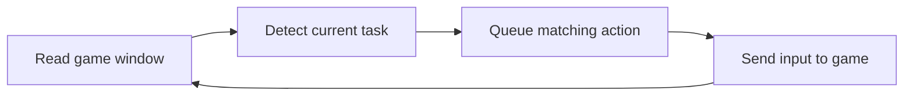

# cts-supermarket-script

*A standalone automation script for players who want to spend less time on repetitive cleanup loops in "Clean the Supermarket!".*

## What this is

**cts-supermarket-script** is a Windows utility built around the game "Clean the Supermarket!". The game rewards steady, repeated cleanup actions — mopping aisles, restocking shelves, clearing spills — and after a few sessions that repetition stops being fun and starts being a chore. This script automates the mechanical parts of that loop so you can focus on layout planning, event timing, and the decisions that actually matter.

The project ships as a single executable with no installer wizard and no background service. You run it, point it at the game window, and it handles the routine motions while you supervise. It does not modify game files, does not touch save data directly, and does not claim to unlock content you haven't earned — it simply reduces the manual repetition between the parts of the game you actually want to play.

| | cts-supermarket-script | Manual play | Generic macro recorder |
|---|---|---|---|
| Setup time | Under 2 minutes | None | 10–20 minutes of scripting |
| Adapts to game state | Yes (reads screen state) | N/A | No (fixed replay only) |
| Windows toolchain required | No | No | Often (Python/AHK runtime) |
| Maintained for this game specifically | Yes | N/A | No |
| Risk of breaking on UI updates | Low (updated with game) | None | High |

  

The button above opens the project's landing page, where the current build is available for download.

## Who it is for

- Players who've cleared the early levels and now find the cleanup loop repetitive rather than challenging.
- Streamers and video creators who need consistent, hands-free gameplay footage for longer sessions.
- Players managing a large store layout who want to keep every aisle maintained without constant tab-switching.
- People testing supermarket layouts and wanting to see how a design performs under steady, unattended play.
- Anyone returning to the game after a break who wants routine tasks handled while they re-learn the current version.

## What you can do

- **Automate spill and mess cleanup** across multiple aisles in sequence.
- **Queue shelf restocking** so inventory stays full without manual checks.
- **Set active hours** so the script only runs during specific in-game shifts.
- **Pause instantly** with a single hotkey when you need to take back manual control.
- **Track a simple run log** showing what actions were taken and when.
- **Adjust action pacing** to match slower or faster play styles.
- **Run in the background** while the game window stays focused, without extra overlays.
- **Save named profiles** for different store layouts or play sessions.

## Getting started

1. Visit the project landing page using the download button on this page.
2. Download the latest build for your Windows version.
3. Extract the files to any folder — no installation step is required.
4. Launch "Clean the Supermarket!", then run the script's executable.
5. Select a profile (or create one) and start a run from the script's main window.

## Requirements

- Windows 10 or Windows 11 (64-bit).
- No additional runtime, framework, or toolchain — the build is standalone.
- "Clean the Supermarket!" installed and able to run in windowed or borderless mode.
- Roughly 50 MB of free disk space.

## How it works

The script reads the current game window, identifies the relevant on-screen state, and issues input actions that mirror what a player would do manually.

1. It captures the visible game window at a set interval.
2. It checks which task is currently active (cleanup, restock, checkout, etc.).
3. It matches that task against your selected profile's rules.
4. It sends the corresponding keyboard or mouse input.
5. It logs the action and repeats the cycle until paused.

## Common Pitfalls

**The script doesn't detect the game window.**
Make sure "Clean the Supermarket!" is running in windowed or borderless mode, not exclusive fullscreen, and that the window title hasn't been renamed by a mod or overlay.

**Actions fire but nothing happens in-game.**
Some overlays (recording software, GPU utilities) can intercept input. Try disabling overlays one at a time to find the conflict.

**The script runs slower after a game update.**
UI layouts occasionally shift after updates. Check the landing page for a matching build before assuming something is broken locally.

**Windows flags the executable on first run.**
This is common for small, unsigned utilities. Verify the download came from the official landing page link before proceeding.

## FAQ

**Does this work with the current version of Clean the Supermarket!?**
Builds are updated to track the game's UI. Check the landing page for the version matched to your current game update before running.

**Will this get my account banned?**
No system that reads screen state and sends input can guarantee zero risk with any online game. Use it on accounts you're comfortable taking that risk with, and review the game's terms of service.

**Can I run this on Mac or Linux?**
Not currently. The script is built and tested for Windows 10/11 only.

**Do I need to keep the script window open while playing?**
Yes — closing it stops the automation loop immediately, which is intentional for control.

**Can I customize which tasks it automates?**
Yes, through profiles. You can enable or disable specific task types per profile.

## License

This project is released under the [MIT License](LICENSE). It is provided as-is, with no warranty of any kind, and no guarantee of compatibility with future versions of "Clean the Supermarket!". Use it at your own discretion.

  

